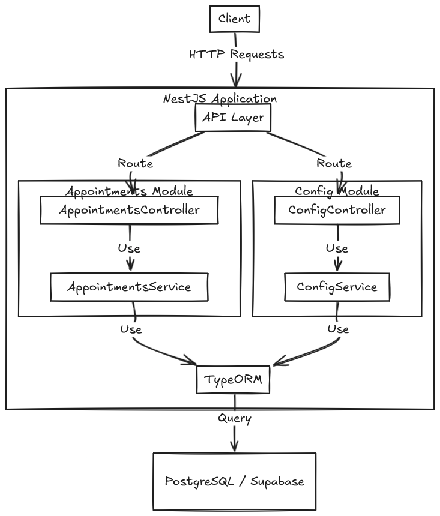

# Appointment Scheduling System

## Overview

This project is an Appointment Scheduling System built with NestJS, designed to manage appointments efficiently. It provides features for booking, canceling, and viewing available appointment slots, along with configurable system settings.

## Table of Contents

- [Appointment Scheduling System](#appointment-scheduling-system)
  - [Overview](#overview)
  - [Table of Contents](#table-of-contents)
  - [Features](#features)
  - [Technology Choices](#technology-choices)
    - [PostgreSQL and Supabase](#postgresql-and-supabase)
      - [PostgreSQL](#postgresql)
      - [Supabase](#supabase)
  - [System Design](#system-design)
    - [Architecture](#architecture)
    - [Key Components](#key-components)
    - [Data Flow](#data-flow)
  - [Installation](#installation)
  - [Configuration](#configuration)
  - [API Endpoints](#api-endpoints)
  - [Database Schema](#database-schema)
    - [Appointment Table](#appointment-table)
    - [Config Table](#config-table)
  - [Deployment](#deployment)
  - [Areas for Improvement](#areas-for-improvement)

## Features

- Book appointments
- Cancel appointments
- View available appointment slots
- Configurable operational hours and days
- Configurable appointment slot duration
- Integration with Supabase for PostgreSQL database

## Technology Choices

### PostgreSQL and Supabase

This project uses PostgreSQL as the database, hosted on Supabase. Here's why these technologies were chosen:

#### PostgreSQL

1. **Robust and Reliable**: PostgreSQL is known for its reliability, data integrity, and correctness. It's an excellent choice for applications that require data consistency and ACID compliance.

2. **Advanced Features**: PostgreSQL offers advanced features like full-text search, complex queries, and JSON support, which can be beneficial as the application grows.

3. **Scalability**: It can handle large amounts of data and complex queries efficiently, making it suitable for applications that may need to scale in the future.

4. **Open Source**: Being open-source, PostgreSQL has a large community, extensive documentation, and regular updates.

5. **Time and Date Handling**: PostgreSQL has excellent support for date and time operations, which is crucial for an appointment scheduling system.

#### Supabase

1. **Simplified Database Management**: Supabase provides a user-friendly interface for managing PostgreSQL databases, making it easier to set up, monitor, and maintain the database.

2. **Built-in API**: Supabase automatically generates RESTful APIs for your database, which can speed up development and provide additional flexibility.

3. **Real-time Capabilities**: Supabase offers real-time subscriptions, which could be useful for future features like live updates of appointment availability.

4. **Authentication and Authorization**: While not utilized in the current version, Supabase provides built-in auth features that could be valuable for future enhancements.

5. **Scalability**: Supabase is built on top of AWS, ensuring good performance and the ability to scale as the application grows.

6. **Cost-Effective**: Supabase offers a generous free tier and reasonable pricing for growing applications, making it cost-effective for projects of various sizes.

7. **Seamless Integration**: Supabase integrates well with modern web technologies and frameworks, including NestJS.

By using PostgreSQL with Supabase, this project benefits from a powerful, scalable database system with the added advantages of simplified management, automatic API generation, and potential for easy feature expansion in the future. This combination provides a solid foundation for building a robust and scalable appointment scheduling system.

## System Design

Below is a high-level diagram of the Appointment Scheduling System architecture:

This diagram illustrates the flow of data from the client through the various layers of the NestJS application, ultimately interacting with the PostgreSQL database hosted on Supabase.

### Architecture

The system follows a modular architecture using NestJS:

- `AppointmentsModule`: Handles appointment-related operations
- `ConfigModule`: Manages system configuration

### Key Components

1. **AppointmentsController**: Exposes API endpoints for appointment operations
2. **AppointmentsService**: Implements business logic for appointments
3. **ConfigController**: Exposes API endpoints for system configuration
4. **ConfigService**: Manages system configuration
5. **Appointment Entity**: Represents the appointment data structure
6. **Config Entity**: Represents the system configuration data structure

### Data Flow

1. Client sends a request to book an appointment
2. AppointmentsController receives the request
3. AppointmentsService validates the request against current configuration
4. If valid, AppointmentsService creates a new appointment in the database
5. Response is sent back to the client

## Installation

1. Clone the repository
2. Install dependencies by running `npm install`
3. Set up environment variables:
Create a `.env` file in the root directory and add: `DATABASE_URL=your_supabase_connection_string`
4. Run the application: `npm run start:dev`

## Configuration

System configuration can be managed through the `/config` endpoint. Configurable parameters include:

- Slot duration (minimum 5 minutes)
- Operational start time
- Operational end time
- Operational days

## API Endpoints

- `GET /appointments/available-slots`: Get available appointment slots
- `POST /appointments/book`: Book an appointment
- `DELETE /appointments/:id`: Cancel an appointment
- `GET /config`: Get current system configuration
- `PUT /config`: Update system configuration

## Database Schema

### Appointment Table
- id: number (Primary Key)
- date: string
- time: string
- slots: number

### Config Table
- id: number (Primary Key)
- slotDuration: number
- maxSlotsPerAppointment: number
- operationalStartTime: string
- operationalEndTime: string
- operationalDays: number[]

## Deployment

1. Build the application: `npm run build`
2. Set up your production environment variables
3. Start the production server: npm run start:prod

## Areas for Improvement

While the current implementation provides a solid foundation for an appointment scheduling system, there are several areas where it could be enhanced:

1. **User Authentication**: Implement user authentication to allow different types of users (e.g., administrators, staff, clients) with varying levels of access.

2. **Multiple Service Types**: Add support for different types of appointments or services, each with its own duration and availability.

3. **Recurring Appointments**: Implement functionality for scheduling recurring appointments (e.g., weekly, monthly).

4. **Notifications**: Integrate an email or SMS notification system for appointment reminders and updates.

5. **Timezone Support**: Add support for multiple timezones to cater to a global user base.

6. **Waiting List**: Implement a waiting list feature for fully booked time slots.

7. **Calendar Integration**: Allow integration with popular calendar services (Google Calendar, iCal, etc.).

8. **Reporting and Analytics**: Add features for generating reports and analyzing appointment data.

9. **Frontend Application**: Develop a user-friendly frontend application to interact with the API.

10. **Performance Optimization**: Implement caching strategies and optimize database queries for improved performance as the system scales.

11. **Localization**: Add support for multiple languages to make the system accessible to a wider audience.

12. **Automated Testing**: Expand the test suite with more unit tests and integration tests to ensure system reliability.

These improvements would enhance the functionality, usability, and scalability of the appointment scheduling system, making it more robust and feature-rich for various use cases.

